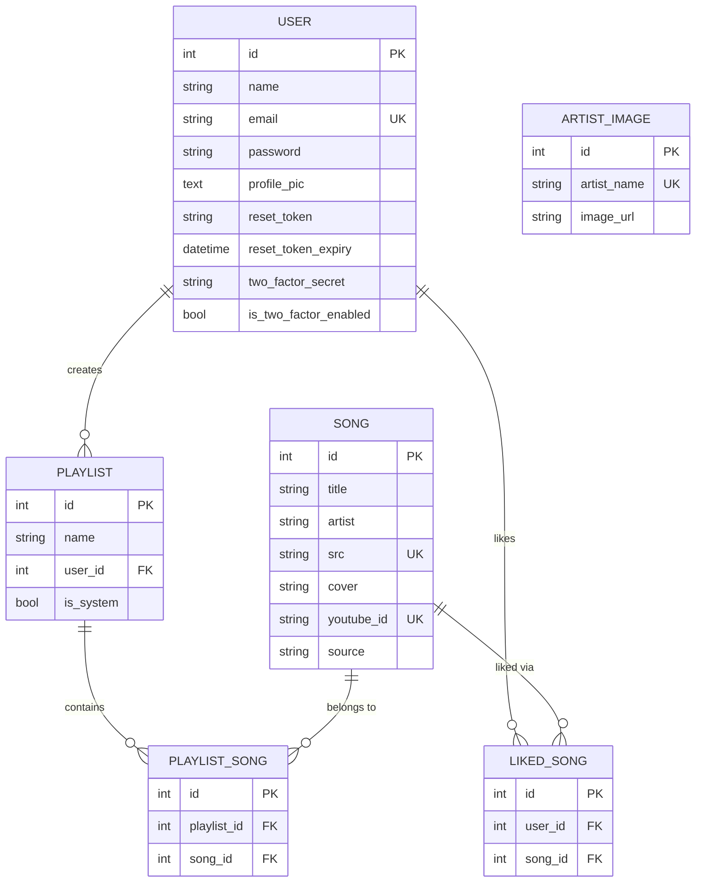
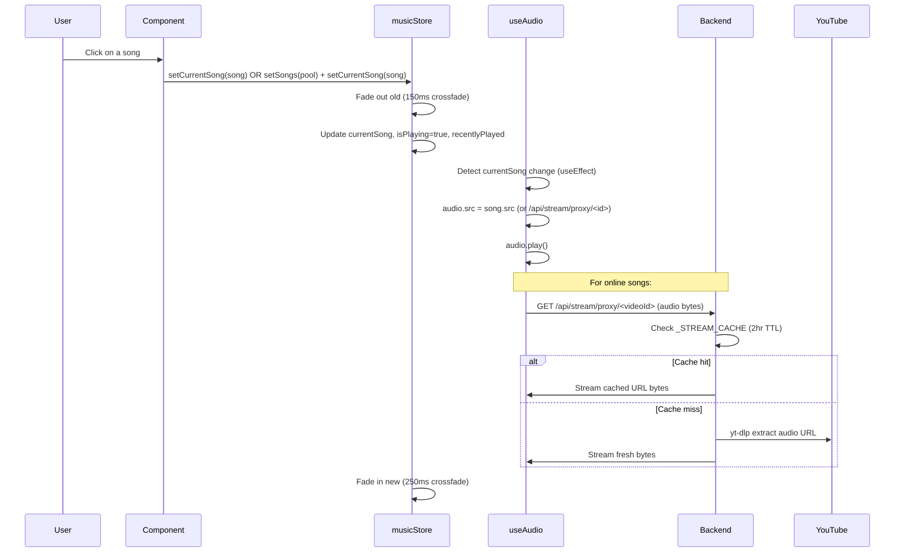
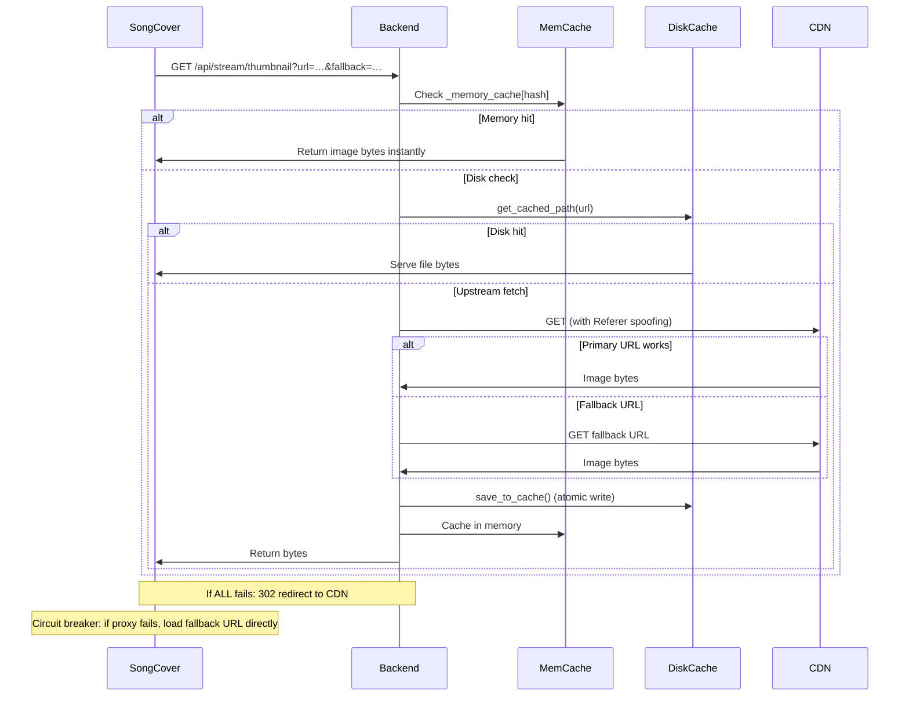
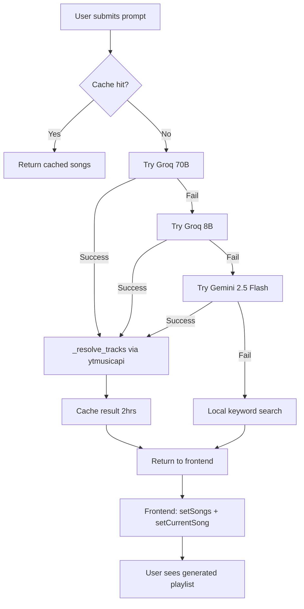

# RhyMic — Complete Codebase Knowledge Document

> **Generated Post-Phase 25 (June 2026)**  
> Self-contained reference for any engineer implementing features, fixing bugs, or refactoring RhyMic.

---

## Table of Contents

1. [High-Level Overview](#1-high-level-overview)
2. [Tech Stack & Dependencies](#2-tech-stack--dependencies)
3. [Repository Layout](#3-repository-layout)
4. [System Architecture](#4-system-architecture)
5. [Database Schema](#5-database-schema)
6. [Backend — Routes & API](#6-backend--routes--api)
7. [Frontend — State Management (Zustand)](#7-frontend--state-management-zustand)
8. [Frontend — Component Map](#8-frontend--component-map)
9. [Frontend — Custom Hooks](#9-frontend--custom-hooks)
10. [Feature-by-Feature Analysis](#10-feature-by-feature-analysis)
11. [Data Flow Diagrams](#11-data-flow-diagrams)
12. [Cross-Cutting Concerns](#12-cross-cutting-concerns)
13. [Things You Must Know Before Changing Code](#13-things-you-must-know-before-changing-code)
14. [Glossary & Term Reference](#14-glossary--term-reference)
15. [Internal API Reference](#15-internal-api-reference)
16. [Assumptions & Open Questions](#16-assumptions--open-questions)

---

## 1. High-Level Overview

**RhyMic** is a full-stack, enterprise-grade music streaming web application with a glassmorphism premium aesthetic. It behaves like Spotify in terms of user experience but integrates AI capabilities for smart playlist generation and metadata auto-correction.

### What It Does

| Feature | Business Purpose |
|---|---|
| Local song library streaming | Play MP3 files stored on the server |
| YouTube Music online streaming | Access unlimited online catalog without licensing |
| Smart DJ (AI Playlist Generation) | Recommend songs based on a natural-language mood/vibe prompt |
| Discover (Genre-based browsing) | Browse songs grouped by genre/language |
| Liked Songs | Personalize the experience by bookmarking favorites |
| User-created Playlists | Organise songs into named collections |
| Audio Lab (10-Band EQ + Bass Boost) | Enhance sound quality per user preference |
| Visualizer | Animated canvas reacting to audio data in real-time |
| 2FA Authentication | Enterprise-grade account security via TOTP |
| Local File Upload | Play MP3s from the browser session without server upload |
| Artist Detail pages | Browse songs grouped by artist |
| Online Search | Full-text search YouTube Music catalog in real-time |

### Target Users

Music enthusiasts wanting a premium, Spotify-like interface with AI personalization and no subscription requirement.

---

## 2. Tech Stack & Dependencies

### Backend (`requirements.txt`)

| Package | Role |
|---|---|
| `Flask` | Core web framework |
| `Flask-SQLAlchemy` | ORM for database access |
| `Flask-Migrate` + `alembic` | Database migrations |
| `Flask-Bcrypt` | Password hashing |
| `Flask-JWT-Extended` | JWT token authentication |
| `Flask-Limiter` | Rate limiting on auth endpoints |
| `Flask-Cors` | CORS headers for frontend access |
| `google-genai` | Gemini AI API (`gemini-2.5-flash` default model) |
| `python-dotenv` | `.env` file loading |
| `ytmusicapi` | YouTube Music search (no API key needed) |
| `yt-dlp` | Audio stream URL extraction from YouTube |
| `pyotp` + `qrcode` | TOTP-based Two-Factor Authentication |
| `requests` | HTTP client for thumbnail proxying |
| `psycopg2-binary` | PostgreSQL driver |
| `supabase` | Cloud storage for thumbnails and profile pics |
| `gunicorn` | Production WSGI server |
| `email_validator` | Email format validation |

### Frontend (`package.json`)

| Package | Role |
|---|---|
| `react@19` | UI library |
| `react-router-dom@7` | SPA routing |
| `zustand@5` | Global state management |
| `framer-motion@12` | Animations and page transitions |
| `axios@1` | HTTP client wrapping API calls |
| `@hello-pangea/dnd` | Drag-and-drop queue reordering |
| `lucide-react` | Icon library |
| `react-hot-toast` | Non-blocking notification toasts |
| `vite@7` | Build tool and dev server |

---

## 3. Repository Layout

```
Rhymic-main/
├── app.py                          # Flask entry point (1 line: imports create_app)
├── backend/
│   ├── __init__.py                 # create_app() factory — wires all extensions & routes
│   ├── config.py                   # DevelopmentConfig / ProductionConfig / TestConfig
│   ├── extensions.py               # Flask extension singletons (db, bcrypt, jwt, cors…)
│   ├── models/
│   │   ├── song.py                 # Song + ArtistImage DB models
│   │   ├── playlist.py             # Playlist + PlaylistSong + LikedSong models
│   │   ├── user.py                 # User model with 2FA fields
│   │   └── mood.py                 # (Unused — placeholder)
│   ├── routes/
│   │   ├── __init__.py             # Blueprint registration: register_routes()
│   │   ├── auth.py                 # /api/login, signup, 2FA, password reset
│   │   ├── songs.py                # /api/songs/ (list + detail)
│   │   ├── playlists.py            # /api/playlists/ (CRUD + add_song)
│   │   ├── likes.py                # /api/likes/ (toggle + list)
│   │   ├── ai.py                   # /api/ai/recommend, /api/ai/categorize-genres
│   │   ├── stream.py               # /api/stream/… (search, proxy, thumbnail, trending)
│   │   ├── mood.py                 # /api/mood/<id> (rotational color-cycle mood)
│   │   └── artists.py              # /api/artists/
│   └── services/
│       ├── scanner.py              # On-startup: walk music/ dir → populate DB
│       ├── metadata_fixer.py       # Background thread: Gemini AI fixes "Unknown Artist"
│       ├── cache_service.py        # ThumbnailCache — disk + memory cache for images
│       ├── online_provider.py      # Audio stream URL resolver (yt-dlp / Piped / resolver)
│       ├── storage_service.py      # Supabase storage (profile pics + cloud thumbnails)
│       ├── email_service.py        # Password recovery email sender
│       └── artist_images.py        # Artist image lookup helper
├── migrations/                     # Alembic migration scripts
├── instance/
│   └── site.db                     # SQLite database (dev / fallback)
├── rhymic-react/
│   ├── index.html                  # SPA entry HTML
│   ├── vite.config.js              # Vite config — dev proxy to :5000
│   └── src/
│       ├── main.jsx                # React entry — mounts <App> inside BrowserRouter
│       ├── App.jsx                 # Root layout, routing, lazy-loaded overlays
│       ├── index.css               # Global reset + CSS variable tokens
│       ├── App.module.css          # App grid layout styles
│       ├── store/
│       │   ├── musicStore.js       # ★ Core state: queue, song, audio graph
│       │   ├── authStore.js        # Auth: login/logout/2FA/profile
│       │   └── uiStore.js          # UI booleans: panels, overlays, visualizer
│       ├── hooks/
│       │   ├── useAudio.js         # HTML5 <audio> lifecycle management
│       │   ├── useAudioEngine.js   # Web Audio API graph construction
│       │   └── useVisualizer.js    # Canvas animation loop (4 modes)
│       ├── services/
│       │   └── api.js              # Axios instance + all API call wrappers
│       ├── utils/
│       │   └── preloadImages.js    # Batch IntersectionObserver image preloader
│       └── components/             # 28+ UI components (each has .jsx + .module.css)
├── requirements.txt
├── GEMINI.md                       # AI engineer context document
└── .env / .env.example             # Environment variables
```

---

## 4. System Architecture

### Application Architecture Pattern

- **Backend**: Flask Application Factory pattern (`create_app()`), Blueprint-based route organization
- **Frontend**: React SPA with Zustand global state, React Router DOM v7, lazy-loaded overlays
- **Communication**: REST API over HTTP, JWT auth tokens in `Authorization: Bearer` header
- **Database**: SQLite (dev/fallback) or PostgreSQL via Supabase (production)
- **Audio**: HTML5 `<audio>` element → Web Audio API graph → Canvas visualizer

### Deployment Architecture

```
                    [Browser]
                       │
              ┌────────┴────────┐
              │   Vite Dev      │  (dev: port 5173, proxies /api → :5000)
              │   Flask Prod    │  (prod: gunicorn serves dist/ + /api)
              └────────┬────────┘
                       │ REST
              ┌────────▼────────┐
              │   Flask App     │
              │  (Blueprint     │
              │   routes)       │
              └──┬──────┬───────┘
           SQLite/    Supabase
           Postgres    (thumbnails
           (DB)        + avatars)
                         │
                  External APIs:
                  - YouTube Music API (ytmusicapi)
                  - yt-dlp (audio URLs)
                  - Groq API (LLaMA 70B / 8B)
                  - Gemini API (2.5 Flash)
```

### Z-Index Layer Stack (Critical — Do Not Alter)

| Z-Index | Element |
|---|---|
| `10` | Sidebar, Topbar |
| `50` | Desktop ProgressBar |
| `1000` | Modals |
| `9999` | `<MobilePlayer>` — fullscreen overlay |
| `15000` | `<RightPanel className={styles.desktopOverlay}>` — queue drawer over player |
| `20000` | RightPanel resize handle (must be interactable above everything) |

### CSS Design Token Convention

All colours and spacing use CSS variables defined in `src/index.css`:
- `--accent-primary` → golden/amber hue (play buttons, active icons, sliders)
- `--bg-base`, `--bg-elevated` → dark backgrounds
- `--text-primary`, `--text-secondary`, `--text-muted` → text hierarchy
- **Never hardcode `#1db954` (Spotify green)**

---

## 5. Database Schema

### Entity-Relationship Diagram



### Key Model Notes

- **`Song.source`**: Either `"local"` (MP3 on server) or `"online"` (YouTube Music stream)
- **`Song.id`**: For online songs, `to_dict()` returns `youtube_id` as the public `id` field; the true integer PK is exposed as `db_id`
- **`Song.src`**: For local songs, a `/assets/music/…` path; for online, `/api/stream/proxy/<videoId>`
- **`Playlist.is_system`**: `True` = auto-generated from music folder structure; `False` = user-created
- **`User.reset_token`**: 6-digit PIN stored in plaintext (not hashed) with a 15-minute expiry

---

## 6. Backend — Routes & API

### Blueprint Registration (`backend/routes/__init__.py`)

All blueprints are registered with URL prefixes:

```python
register_routes(app)
# auth_bp    → /api
# songs_bp   → /api/songs
# playlists_bp → /api/playlists
# likes_bp   → /api/likes
# ai_bp      → /api/ai
# stream_bp  → /api/stream
# mood_bp    → /api/mood
# artists_bp → /api/artists
```

### Auth Routes (`/api`)

| Method | Path | Auth | Description |
|---|---|---|---|
| POST | `/signup` | No | Create account. Validates username (3-30 alphanum), email, password (8+ chars, 1 number). Rate: 3/min |
| POST | `/login` | No | Authenticate. Returns JWT or `2fa_required: true` + temp_token. Rate: 5/min |
| POST | `/forgot-password` | No | Send 6-digit PIN to email. PIN expires in 15 min. Rate: 3/min |
| POST | `/reset-password` | No | Verify PIN + set new password. |
| POST | `/2fa/setup` | JWT | Generate TOTP secret + QR code (base64 PNG). Stores secret pending confirmation. |
| POST | `/2fa/enable` | JWT | Verify first TOTP code → sets `is_two_factor_enabled = True`. |
| POST | `/2fa/verify` | temp_JWT | Exchange temp token + TOTP code → full JWT. |
| GET | `/user/me` | JWT | Return current user's profile dict. |
| POST | `/user/upload_profile_pic` | JWT | Upload profile image (5MB limit). Tries Supabase first, falls back to local disk. |
| PATCH | `/user/update` | JWT | Update username. |
| POST | `/user/change-password` | JWT | Verify old + set new password. |

### Songs Routes (`/api/songs`)

| Method | Path | Auth | Description |
|---|---|---|---|
| GET | `/?page=1&limit=100` | JWT | Paginated song list from DB |
| GET | `/<id>` | JWT | Single song by ID |

### Playlists Routes (`/api/playlists`)

| Method | Path | Auth | Description |
|---|---|---|---|
| GET | `/` | JWT | All user playlists + all system playlists |
| GET | `/<id>` | JWT | Playlist with embedded songs array (joinedload optimized) |
| POST | `/` | JWT | Create user playlist |
| DELETE | `/<id>` | JWT | Delete user playlist (system playlists protected) |
| PATCH | `/<id>` | JWT | Rename playlist |
| POST | `/add_song` | JWT | Add song to playlist. Handles `Song.ensure_online_song()` to persist online songs to DB |

### Likes Routes (`/api/likes`)

| Method | Path | Auth | Description |
|---|---|---|---|
| GET | `/` | JWT | Returns list of liked song IDs for current user |
| POST | `/` | JWT | Toggle like on a song (body: `{ song: {...} }`) |

### AI Routes (`/api/ai`)

| Method | Path | Auth | Description |
|---|---|---|---|
| POST | `/recommend` | JWT | Smart DJ: send `{ prompt, regenerate }` → returns `{ title, songs, source, cached }` |
| POST | `/categorize-genres` | JWT | Gemini categorizes local library into provided genre arrays |

**Smart DJ fallback chain** (in order):
1. Groq LLaMA 3.3-70B (primary, fastest)
2. Groq LLaMA 3.1-8B (secondary)
3. Gemini 2.5 Flash (tertiary)
4. Local keyword search (final offline fallback)

Results from 1-3 are resolved via `_resolve_tracks()` → parallel ytmusicapi search → each becomes a streamable song object.

### Stream Routes (`/api/stream`)

| Method | Path | Auth | Description |
|---|---|---|---|
| GET | `/status` | JWT | Returns `{ mode, enabled, resolver_configured }` |
| GET | `/search?q=` | JWT | YouTube Music song search (filter=songs, up to 15 results) |
| GET | `/categories?names=&limit=` | JWT | Returns songs grouped by genre (up to 12 categories) |
| GET | `/trending` | JWT | 15 trending songs from ytmusicapi |
| GET | `/related/<videoId>` | JWT | YouTube Music radio mix (~25 songs) |
| GET | `/audio/<videoId>` | JWT | Returns direct audio stream URL (JSON) |
| GET | `/proxy/<videoId>` | No | **Direct byte proxy** — browsers hit this for actual audio. Supports HTTP Range for seeking. |
| GET | `/thumbnail?url=&fallback=` | No | 4-layer thumbnail proxy: memory → disk → upstream fetch → 302 redirect |

---

## 7. Frontend — State Management (Zustand)

### `musicStore.js` — The Music Brain

**State fields:**

```
songs[]           → Master song catalog from /api/songs (NEVER overwrite by setSongs)
currentSong       → Currently playing Song object
queue[]           → Current playback context (may differ from songs[])
originalQueue[]   → Saved queue order for shuffle restore
recentlyPlayed[]  → Last 20 played songs (prepended on each setCurrentSong)
likedSongs[]      → Array of liked song IDs
playlists[]       → User + system playlists
currentPlaylist   → Detailed playlist with songs array (fetched on demand)
isPlaying         → Boolean
currentTime       → Float (seconds, updated 4x/sec by timeupdate event)
duration          → Float (total track duration)
volume            → Float 0-1
shuffle           → Boolean
repeat            → Boolean
audioElement      → Reference to the HTML <audio> DOM element
audioContext      → Web Audio API AudioContext singleton
analyserNode      → AnalyserNode (shared with useVisualizer)
crossfadeNode     → GainNode for smooth transitions
eqBands[]         → 10 floats (dB per frequency band)
bassBoost         → Float (dB)
aiCategories      → Gemini-categorized genre map (cached, fetched once)
currentMood       → String (rotates through 6 values on each track change)
error             → String | null (auto-clears after 3s on playback error)
```

**Critical Actions:**

| Action | Behaviour |
|---|---|
| `setSongs(songs)` | Sets ONLY `queue` + `originalQueue`. **Does NOT touch `state.songs`**. Normalises online covers to `=s0`. |
| `setCurrentSong(song)` | Starts 150ms crossfade out → switches song immediately → starts 250ms crossfade in. Updates `recentlyPlayed`. |
| `togglePlay()` | Fade-out (150ms) then `isPlaying = false`, or `isPlaying = true` then fade-in (200ms). |
| `nextSong()` | Finds current index in queue, wraps around. Crossfades. |
| `playNext(song)` | Inserts song after current in queue. Deduplication guard: no-ops if already in queue. |
| `addToQueue(song)` | Appends to end of queue. Deduplication guard. |
| `toggleShuffle()` | On: saves original order, Fisher-Yates shuffles queue. Off: restores `originalQueue`. |
| `fetchSongs()` | Calls `/api/songs/`, sets `state.songs`, preloads first 24 thumbnails. |
| `fetchAiCategories()` | POSTs to `/api/ai/categorize-genres`. Fire-and-forget; sets `aiCategories` when complete. |

### `authStore.js` — Authentication

**State fields:** `user`, `token`, `tempToken`, `error`

Both `user` and `token` are persisted to `localStorage` and rehydrated on page load.

**Actions:** `login`, `signup`, `logout`, `verify2FA`, `setup2FA`, `enable2FA`, `forgotPassword`, `resetPassword`, `fetchUser`, `uploadProfilePic`, `updateProfile`, `changePassword`

**2FA flow:**
1. `login()` → if `data['2fa_required']` → stores `tempToken` → returns `'2fa_required'`
2. UI switches to `'tfa'` mode
3. `verify2FA(code)` → uses `tempToken` in Authorization header → gets full JWT

### `uiStore.js` — UI State

```
isSidebarOpen        → Mobile sidebar drawer
isSidebarCompact     → Desktop compact sidebar mode
isPlayerOpen         → MobilePlayer fullscreen overlay
isRightPanelOpen     → Queue drawer (defaults true when window > 1200px)
isVisualizerOpen     → Canvas visualizer overlay
visualizerMode       → 'bars' | 'waveform' | 'circle' | 'particles'
isAudioLabOpen       → EQ + bass boost panel
```

---

## 8. Frontend — Component Map

### App Layout (`App.jsx`)

```
<App>
  └── <AppContent>  (renders conditionally based on token + route)
       ├── Auth routes: <LandingPage> | <Login> | <Signup>
       └── Main app (grid layout):
           ├── <Sidebar>                    (z:10, left column)
           ├── <main>
           │   ├── <Topbar>                 (z:10, top row)
           │   └── scrollable content
           │       └── <Routes> (AnimatePresence)
           │           ├── / → <Home>
           │           ├── /discover → <Discover>
           │           ├── /explore → <OnlineSearch>
           │           ├── /playlist/:id → <PlaylistDetails>
           │           ├── /liked → <LikedSongsPage>
           │           ├── /artist/:name → <ArtistDetail>
           │           ├── /profile → <Profile>
           │           ├── /settings → <Settings>
           │           ├── /upload → <UploadMetadata>
           │           ├── /dj → <SmartDJ>
           │           └── /subscribe → <PremiumPlaceholder>
           ├── <RightPanel isOverlay={isPlayerOpen}> (z:15000 when overlay)
           ├── <ProgressBar>                (z:50, bottom bar — executes useAudio + useAudioEngine)
           ├── <MoodOrb>                   (decorative ambient glow)
           ├── <AudioLab>                  (z:1000 modal, EQ panel)
           ├── <Visualizer>               (canvas overlay)
           └── <MobilePlayer>             (z:9999, fullscreen overlay)
```

### Component Descriptions

| Component | File | Purpose |
|---|---|---|
| `Sidebar` | `Sidebar.jsx` | Left nav: logo, links, user playlists list |
| `Topbar` | `Topbar.jsx` | Search bar, breadcrumb, user avatar menu |
| `ProgressBar` | `ProgressBar.jsx` | Persistent bottom player: controls, scrubber, volume, EQ/Viz/Queue toggles. **Hosts `useAudio()` and `useAudioEngine()`** |
| `MobilePlayer` | `MobilePlayer.jsx` | Fullscreen overlay player with 3D tilt album art, all controls |
| `RightPanel` | `RightPanel.jsx` | Queue drawer with drag-and-drop reorder; resizable (300–600px) |
| `AudioLab` | `AudioLab.jsx` | 10-band EQ + bass boost. 5 presets (Flat, Acoustic, Bass Heavy, Electronic, Vocal Boost) |
| `Visualizer` | `Visualizer.jsx` | Canvas wrapper that calls `useVisualizer()` |
| `SongCover` | `SongCover.jsx` | Image component with 3-stage fallback + "Liquid Gold" animated placeholder |
| `Home` | `Home.jsx` | Home page: Hero, trend rails, personalized rail, popular songs |
| `Discover` | `Discover.jsx` | Genre category rows (online or local fallback) |
| `OnlineSearch` | `OnlineSearch.jsx` | Real-time YouTube Music search |
| `SmartDJ` | `SmartDJ.jsx` | AI prompt → playlist generation UI |
| `Login` | `Login.jsx` | Multi-mode auth form (login/signup/forgot/reset/2FA) |
| `Settings` | `Settings.jsx` | Profile, password, and 2FA management |
| `UploadMetadata` | `UploadMetadata.jsx` | Local file upload: bulk play/shuffle/queue (Blob URLs, session-only) |
| `ArtistDetail` | `ArtistDetail.jsx` | Artist page with songs filtered by artist name |
| `PlaylistDetails` | `PlaylistDetails.jsx` | Playlist view with song list and play controls |
| `LikedSongsPage` | `LikedSongsPage.jsx` | Filtered view of liked songs |
| `Hero` | `Hero.jsx` | Landing carousel / featured section on Home |
| `CategoryRow` | `CategoryRow.jsx` | Horizontal scrollable row of songs for Discover |
| `TopSongs` | `TopSongs.jsx` | Ranked song list component |
| `MoodOrb` | `MoodOrb.jsx` | Decorative ambient orb that reflects `currentMood` |
| `Skeleton` | `Skeleton.jsx` | Loading placeholder components |
| `ContextMenu` | `ContextMenu.jsx` | Right-click context menu for songs |
| `PageWrapper` | `PageWrapper.jsx` | Framer Motion wrapper for route transitions |
| `Modal` | `Modal.jsx` | Generic modal overlay |
| `PremiumPlaceholder` | `PremiumPlaceholder.jsx` | Stub page for unimplemented premium features |

---

## 9. Frontend — Custom Hooks

### `useAudio.js` — HTML5 Audio Lifecycle

**Location:** `src/hooks/useAudio.js`  
**Called from:** `ProgressBar.jsx` (once, as a singleton)

**Responsibilities:**
1. Creates a single `new Audio()` element with `crossOrigin="anonymous"` (required for Web Audio API canvas CORS)
2. Registers it in `musicStore` via `setAudioElement()`
3. Syncs `currentSong` changes → sets `audio.src`, calls `audio.load()`, calls `audio.play()` if `isPlaying`
4. Syncs `isPlaying` → calls `audio.play()` or `audio.pause()`
5. Syncs `volume` → sets `audio.volume`
6. Attaches listeners: `timeupdate`, `loadedmetadata`, `ended`, `error`
7. **Smart pre-fade**: when `duration - currentTime <= 0.4s`, calls `nextSong()` preemptively (400ms before track end). This is the primary track-end trigger; the `ended` event is a fallback.

**Audio source routing:** For online songs, always routes through `/api/stream/proxy/<videoId>` (same-origin), not the direct YouTube URL, to prevent Canvas CORS taint.

### `useAudioEngine.js` — Web Audio Graph

**Location:** `src/hooks/useAudioEngine.js`  
**Called from:** `ProgressBar.jsx` (once, as a singleton)

**Web Audio Graph Chain:**
```
<audio> element
    │
    └── MediaElementSourceNode
            │
            └── BiquadFilter (LowShelf, 100Hz) [Bass Boost]
                    │
                    └── BiquadFilter[0] (Peaking, 32Hz) ┐
                    └── BiquadFilter[1] (Peaking, 64Hz)  │
                    └── ... (10 bands total)             │ 10-Band EQ
                    └── BiquadFilter[9] (Peaking, 16kHz) ┘
                            │
                            └── AnalyserNode (fftSize=256) ← shared with Visualizer
                                    │
                                    └── GainNode [crossfadeNode] ← volume transitions
                                            │
                                            └── AudioContext.destination
```

**Critical order:** AnalyserNode is BEFORE the crossfadeNode. This ensures the visualizer sees audio data even when gain is being faded to 0 (Phase 25 fix).

**Singleton guard:** The hook checks `audioElement._hasVisualizerSource` before creating `MediaElementSourceNode`. Creating it twice on the same element throws `InvalidStateError`.

### `useVisualizer.js` — Canvas Rendering

**Location:** `src/hooks/useVisualizer.js`  
**Called from:** `Visualizer.jsx`

**4 visualization modes:**
- `'bars'` — vertical frequency bars (default)
- `'waveform'` — oscilloscope time-domain wave with layered glow
- `'circle'` — radial frequency bars rotating around center
- `'particles'` — physics-based particle system reacting to beat amplitude

**Mood colors:**

| Mood | Primary | Secondary |
|---|---|---|
| Chill | `#00f0ff` (cyan) | `#7000ff` (violet) |
| Energetic | `#ff007f` (hot pink) | `#ff4d00` (orange) |
| Melancholy | `#4b0082` (indigo) | `#00008b` (dark blue) |
| Euphoric | `#c8a44e` (gold) | `#fff700` (yellow) |
| Focus | `#00ff88` (green) | `#0088ff` (blue) |
| Romantic | `#ff69b4` (pink) | `#8b0000` (dark red) |

**High-DPI fix:** Canvas drawing coordinates always use `canvas.width / dpr` and `canvas.height / dpr` (not raw pixel dimensions) to account for `devicePixelRatio`.

---

## 10. Feature-by-Feature Analysis

### Feature 1: Music Library & Playback

**Purpose:** Stream MP3 files stored on the server.

**Backend flow:**
1. On startup, `scanner.py:scan_library()` walks `ASSETS_DIR/music/**/*.mp3`
2. Each MP3 is parsed from filename (`Artist - Title.mp3`) → inserted into `Song` table if not present
3. Subdirectory names become `Playlist` records with `is_system=True`
4. Frontend calls `GET /api/songs/?page=1&limit=100` → gets all songs
5. Song `src` field is a relative URL like `/assets/music/Pop/Song.mp3`

**Frontend playback:**
1. User clicks a song → `setCurrentSong(song)` in musicStore
2. `useAudio` detects `currentSong` change → sets `audio.src = currentSong.src` → plays
3. `timeupdate` events update `currentTime` in store → ProgressBar re-renders

**Cross-feature links:** The `songs[]` master list also populates Home rails, TopSongs, LikedSongs filter, and Artist pages.

### Feature 2: YouTube Music Online Streaming

**Purpose:** Access any track from YouTube Music without storing files locally.

**How it works:**
1. `ytmusicapi.search(query, filter="songs")` → returns track metadata (no API key needed)
2. Track object includes `videoId`, `thumbnails`, `duration`, `artists`
3. Frontend stores `src: /api/stream/proxy/<videoId>` as the audio source
4. `useAudio` routes online songs through `/api/stream/proxy/<videoId>`
5. Proxy calls `get_audio_stream_url(videoId)` → tries resolver → yt-dlp → Piped API in order
6. Resolved URL is cached in `_STREAM_CACHE` for 2 hours (configurable via `STREAM_CACHE_TTL_SECONDS`)
7. Proxy streams bytes to browser with `Accept-Ranges: bytes` support for seeking

**Stream provider modes** (env `ONLINE_STREAM_PROVIDER`):
- `extractor` (default) — tries resolver → yt-dlp → Piped
- `resolver` — only tries custom resolver service
- `auto` — resolver + yt-dlp + Piped  
- `disabled` — online streaming off

### Feature 3: Thumbnail Proxy & Caching

**Purpose:** Prevent CDN blocking, ensure thumbnails always load, cache efficiently.

**4-layer proxy architecture** (`/api/stream/thumbnail`):
1. **Memory cache** (`_memory_cache` dict) — instant, no I/O
2. **Disk cache** (`ThumbnailCache`, stored in `backend/data/cache/thumbnails/`) — persistent
3. **Upstream fetch** — fetches from Google/YouTube CDN with `Referer: https://music.youtube.com/` spoofing; tries `maxresdefault.jpg` first, falls back to original
4. **302 redirect** — if everything fails, redirects browser to fetch CDN directly (no 500 errors)

**Cache key stability:** `ThumbnailCache._stable_key()` strips volatile session tokens from Google CDN URLs (the `=s0`, `=w500-h500` suffixes), ensuring the same image is served from cache even after token expiry.

**`SongCover` circuit breaker:**
1. Stage 0: loads `/api/stream/thumbnail?url=…&fallback=…`
2. Stage 1: if proxy fails, extracts `fallback` param from URL → loads direct CDN URL
3. Stage 2: if that fails (googleusercontent.com), tries low-res `=s226` variant
4. Final: shows animated "Liquid Gold" fallback placeholder

### Feature 4: Smart DJ (AI Playlist Generation)

**Purpose:** Let users describe a mood or vibe in natural language and get a curated playlist.

**Flow:**
1. User submits prompt to `SmartDJ.jsx`
2. Frontend `POST /api/ai/recommend` with `{ prompt, regenerate }`
3. Backend checks in-memory `_dj_cache` (2-hour TTL, 200-entry LRU)
4. If cache miss, tries 4 layers in order:
   - **Groq LLaMA 70B** → `_call_groq()` → returns JSON array of `{title, artist}`
   - **Groq LLaMA 8B** → fallback if 70B fails
   - **Gemini 2.5 Flash** → `_call_gemini()` → returns `{title, tracks: [{title, artist}]}`
   - **Local random sample** → `_local_keyword_search()`
5. AI tracks (from layers 1-3) are resolved to YouTube Music videoIds via `_resolve_tracks()` (parallel ThreadPoolExecutor with 5 workers)
6. Returns `{ title, songs, source, cached }`
7. Frontend sets queue to generated songs via `setSongs()`
8. Frontend fallback: if backend fails, does keyword search in `state.songs` (local library)

**Saving a DJ playlist:**
- User clicks "Save to Playlist" → creates playlist via `POST /api/playlists/` → adds each song via `POST /api/playlists/add_song`
- Online songs are persisted to DB via `Song.ensure_online_song()`

### Feature 5: Discover — Genre Browsing

**Purpose:** Browse songs organised by genre/language/mood.

**Flow:**
1. `Discover.jsx` loads; checks `/api/stream/status`
2. If online enabled: fetches `/api/stream/categories?names=Hindi,English,Rap,...`
3. Backend `_search_category()` queries ytmusicapi for each genre (cached 30 min)
4. If online disabled or empty: falls back to local system playlists
5. Background (fire-and-forget): `fetchAiCategories()` → Gemini categorizes local library → `aiCategories` state updated
6. `CategoryRow` renders a horizontally scrollable song rail per genre

**AI categorization detail:** Sends entire local song catalog to Gemini with instruction to classify each by genre/language. Returns `{genre: [id1, id2, ...]}`. This result is cached in `musicStore.aiCategories` (never re-fetched once set) to prevent infinite API calls.

### Feature 6: Authentication (Multi-Step UI)

**Purpose:** Secure, multi-step auth with enterprise-grade 2FA.

**Login modes** (all in single `Login.jsx` component with `mode` state):
- `'login'` → email + password
- `'signup'` → name + email + password (with strength meter)
- `'forgot'` → email → sends 6-digit PIN
- `'reset'` → PIN + new password
- `'tfa'` → 6-digit TOTP code

**JWT lifecycle:**
- Access tokens expire in 30 days (dev) / 24 hours (production)
- Temp 2FA tokens expire in 5 minutes
- Stored in `localStorage` (`token`, `user` keys)
- Attached automatically by Axios request interceptor

**2FA setup flow** (in Settings.jsx):
1. `POST /api/2fa/setup` → backend generates TOTP secret, returns QR code as base64 PNG
2. User scans QR with authenticator app
3. User enters first code → `POST /api/2fa/enable` → validates → sets `is_two_factor_enabled = True`

### Feature 7: Audio Lab (EQ + Bass Boost)

**Purpose:** Fine-tune sound output with professional audio tools.

**Architecture:**
- `AudioLab.jsx` renders UI (10 vertical sliders + bass boost slider)
- Sliders write to `musicStore.eqBands[]` and `musicStore.bassBoost`
- `useAudioEngine.js` watches these values via `useEffect` → calls `setTargetAtTime()` on Web Audio `BiquadFilter` nodes with a 50ms ramp for smooth transitions
- 5 presets: Flat, Acoustic, Bass Heavy, Electronic, Vocal Boost

**EQ frequencies:** 32, 64, 125, 250, 500, 1000, 2000, 4000, 8000, 16000 Hz (standard 10-band)

### Feature 8: Visualizer

**Purpose:** Visual audio feedback to enhance listening experience.

- Activated by `isVisualizerOpen` toggle in uiStore
- `Visualizer.jsx` renders `<canvas>` element
- `useVisualizer(canvasRef, mode, isVisualizerOpen)` hooks into `analyserNode` from musicStore
- Animation loop via `requestAnimationFrame` (auto-cancelled on unmount)
- Mode switcher in both ProgressBar and MobilePlayer

### Feature 9: Queue Management

**Purpose:** Control playback order and plan what's next.

- `RightPanel.jsx` renders the current queue (songs after `currentSong` in queue array)
- Drag-and-drop reorder via `@hello-pangea/dnd` → calls `reorderQueue(startIdx, endIdx)`
- Resizable: drag handle calculates `window.innerWidth - e.clientX`, persisted in `localStorage.queueWidth`
- When `isPlayerOpen` (MobilePlayer is visible), RightPanel renders with `isOverlay=true` → CSS applies `z-index: 15000` to appear above the mobile player

### Feature 10: Local File Upload

**Purpose:** Play personal MP3 files from the browser without server upload.

- `UploadMetadata.jsx` accepts files via drag-drop or file picker
- Creates `Blob URLs` for each file (session memory only)
- Provides "Play All", "Shuffle All", "Add to Queue" actions
- Files are NOT sent to the server — purely client-side

### Feature 11: Online Search

**Purpose:** Search YouTube Music catalog directly from the app.

- `OnlineSearch.jsx` sends search term to `GET /api/stream/search?q=…`
- Backend appends "official song" to query + uses `filter="songs"` to avoid covers/remixes
- Results are rendered as clickable song cards → `setCurrentSong()` for playback

### Feature 12: Settings & Profile

**Purpose:** Centralised identity and security management.

- `Settings.jsx` handles: avatar upload, username change, password change, 2FA setup/disable
- All identity changes go through `authStore` actions
- Profile pic: `POST /api/user/upload_profile_pic` → tries Supabase → falls back to local disk `/assets/users/<uuid>.ext`

---

## 11. Data Flow Diagrams

### Playback Initiation Flow



### Thumbnail Resolution Flow



### Smart DJ Flow



---

## 12. Cross-Cutting Concerns

### Security

| Mechanism | Implementation |
|---|---|
| Authentication | Flask-JWT-Extended; 30-day tokens in `localStorage` |
| Password hashing | Flask-Bcrypt (bcrypt rounds) |
| 2FA | pyotp TOTP; QR code generated server-side as base64 PNG |
| Rate limiting | Flask-Limiter: signup 3/min, login 5/min, password reset 3/min |
| Input validation | Email regex, username alphanum 3-30 chars, password 8+ chars + 1 digit |
| Input length | All string fields checked for 255-char max at auth endpoints |
| CORS | Whitelist via `ALLOWED_ORIGINS` env var (defaults `*`) |
| Security headers | X-Content-Type-Options, X-Frame-Options: DENY, X-XSS-Protection, Referrer-Policy |
| Path traversal | Profile pic uploads use `uuid4()` filenames, never user-supplied filenames |
| System playlist protection | Can only delete/rename user-owned, non-system playlists |

### Caching Strategy

| Cache | Location | TTL | Contents |
|---|---|---|---|
| Thumbnail memory cache | Python process dict `_memory_cache` | Process lifetime | Image bytes per URL hash |
| Thumbnail disk cache | `backend/data/cache/thumbnails/` | Permanent | Image files named by SHA256 hash |
| Stream URL cache | Python `_STREAM_CACHE` dict | 2 hours (configurable) | `(url, format, expiry)` per videoId |
| Category search cache | Python `_category_cache` dict | 30 minutes | Songs per genre name |
| Smart DJ cache | Python `_dj_cache` dict | 2 hours | Generated track lists per prompt MD5 |
| Home page trending | Module-level `cachedOnlineRanked` var | Process lifetime | Trending online songs |
| Home personalized | `personalizedCache` Map | Process lifetime | Per-preference-seed online songs |
| AI categories | Zustand `aiCategories` | App session | Genre→ID mapping |

### Error Handling

- **Playback errors:** `useAudio.js` listens for `error` event → calls `handlePlaybackError()` in musicStore → shows error banner → auto-skips after 3s
- **API errors:** Most actions return `false` and set `error` in respective store; components display `error` state
- **Thumbnail errors:** 3-stage retry in `SongCover.jsx` with 120ms delays between attempts
- **AI errors:** Multi-layer fallback chain; last resort is local random songs
- **Backend proxy errors:** Always returns a valid response (302 redirect instead of 500)
- **DB fallback:** If PostgreSQL unreachable at startup, falls back to local SQLite

### Performance Optimizations

- **Image preloading:** `preloadImages()` utility preloads up to N thumbnails using IntersectionObserver on hidden elements
- **Lazy loading:** `OnlineSearch`, `ArtistDetail`, `SmartDJ`, `MobilePlayer`, `Visualizer`, `AudioLab`, `Profile`, `Settings` are all `React.lazy()` loaded
- **Audio stream caching:** 2-hour cache prevents repeat yt-dlp extraction on seek/resume
- **Crossfade:** 150ms fade-out + 250ms fade-in on track changes for smooth transitions
- **Smart pre-fade:** `nextSong()` is called 400ms before track end, not at end, preventing abrupt cutoffs
- **Category caching:** Online category search results cached 30 minutes to avoid repeated API calls
- **joinedload:** Playlist details query uses SQLAlchemy `joinedload` to avoid N+1 queries
- **Atomic disk writes:** Thumbnails written to temp file then renamed to prevent corruption

---

## 13. Things You Must Know Before Changing Code

### ⚠️ State Separation: `songs` vs `queue`

**`state.songs`** = the **master catalog** returned by `/api/songs/`. Only `fetchSongs()` should modify this.

**`state.queue`** = the **current playback context** (may be a playlist, search results, AI-generated songs, etc.).

`setSongs()` sets ONLY `queue` and `originalQueue`. If you call it, the Discover page and Library will NOT disappear. **Never call `set({ songs: ... })` from outside `fetchSongs()`.**

### ⚠️ Audio Graph Singleton

`useAudioEngine.js` checks `audioElement._hasVisualizerSource` before creating `MediaElementSourceNode`. If you remove this guard, calling `createMediaElementSource()` twice on the same element will throw `InvalidStateError` and kill all audio.

Never create a new `AudioContext` or `MediaElementSourceNode` inside any React component render path.

### ⚠️ RightPanel `isOverlay` Prop

`App.jsx` passes `isOverlay={isPlayerOpen}` to `<RightPanel>`. When `isPlayerOpen` is true (MobilePlayer is fullscreen), this prop must be passed so RightPanel can apply `z-index: 15000` via `styles.desktopOverlay`. Removing this prop causes the queue drawer to appear behind the fullscreen player.

### ⚠️ CSS Background URL Quoting

When injecting album cover URLs into CSS `background-image`, **always use double quotes inside the url():**

```javascript
style={{ backgroundImage: `url("${displaySong.cover}")` }}
```

Without quotes, filenames with spaces (e.g., `Alan Walker - Faded.mp3`) crash CSS parsing.

### ⚠️ Queue Deduplication

`playNext()` and `addToQueue()` both start with:
```javascript
if (state.queue.find(s => s.id === song.id)) return state;
```
This guard is intentional. Do not remove it — it prevents duplicate entries that break `findIndex()` navigation.

### ⚠️ Visualizer DPR Scaling

In `useVisualizer.js`, all coordinate calculations use:
```javascript
const width = canvas.width / dpr;
const height = canvas.height / dpr;
```
Never use `canvas.width` directly for coordinate calculations, or elements will be drawn at 2x the intended position on retina screens.

### ⚠️ Analyser → CrossfadeNode Order

In `useAudioEngine.js`, the graph order is:
```
... → EQ[9] → AnalyserNode → CrossfadeGainNode → destination
```
If you swap these, the visualizer will flatline whenever the crossfade gain is at 0 (during rapid pauses).

### ⚠️ Online Song ID Duality

Online songs from YouTube Music have `id = videoId` (a string like `"dQw4w9WgXcW"`). Local songs have `id = integer` from the DB. The `to_dict()` method normalises this:
```python
"id": self.youtube_id if self.source == "online" else self.id
```
All queue operations use `findIndex(s => s.id === currentSong.id)`, which works for both types. Do not assume `id` is always an integer.

### ⚠️ AI Categories: Fire-and-Forget Pattern

`Discover.jsx` calls `fetchAiCategories()` as a non-blocking operation:
```javascript
fetchAiCategories(systemNames).catch(console.error);
```
The `aiCategories` state in musicStore starts as `null` and is set when the API responds. Once set (even to `{}`), it is never re-fetched. **Do not attach a loading spinner or blocking guard** to AI category results — they are supplementary data, not critical.

### ⚠️ MobilePlayer AnimatePresence Pattern

`MobilePlayer.jsx` wraps its content inside `<AnimatePresence>` with the conditional `{isPlayerOpen && <motion.div ...>}` inside it. The component itself must always be mounted (never return null early) so AnimatePresence can animate the exit. This is fixed from a prior bug where early-return caused missing exit animations.

### ⚠️ Thumbnail Cache Key Stability

`ThumbnailCache._get_hash()` uses `_stable_key()` which strips Google CDN size/token parameters (`=s0`, `=w500-h500`, etc.). This ensures cache hits even when the URL changes due to Google session token rotation. Do not hash the raw URL.

### ⚠️ Atomic Thumbnail Writes

Always use `thumbnail_cache.save_to_cache()` — never write to the cache directory directly. The service uses `uuid4()`-based temp files + `os.replace()` for atomic writes that prevent corruption on Windows when multiple threads download concurrently.

---

## 14. Glossary & Term Reference

| Term | Definition |
|---|---|
| **online song** | A song streamed from YouTube Music, identified by `source: "online"` and `id: videoId` |
| **local song** | An MP3 stored in the `assets/music/` directory, identified by `source: "local"` and `id: integer` |
| **system playlist** | Auto-generated playlist from music folder structure, `is_system: true`, not editable by users |
| **master catalog** | `state.songs[]` — the complete list from DB; never mutated except by `fetchSongs()` |
| **queue** | `state.queue[]` — current playback context; populated by `setSongs()`, `setQueue()`, or queue actions |
| **crossfade** | Smooth volume transition using Web Audio `linearRampToValueAtTime()` on the `crossfadeNode` |
| **Smart DJ** | AI playlist generation feature at `/dj` route, backed by `/api/ai/recommend` |
| **aiCategories** | Zustand state: Gemini-assigned genre→songId mapping for local library categorization |
| **`_STREAM_CACHE`** | In-memory Python dict caching resolved YouTube audio URLs for 2 hours |
| **`_memory_cache`** | In-memory Python dict caching thumbnail image bytes for process lifetime |
| **ThumbnailCache** | Disk-based persistent cache for thumbnail images, keyed by stable URL hash |
| **`isOverlay`** | Prop passed to `RightPanel` when `MobilePlayer` is open, triggers z-index: 15000 |
| **`_hasVisualizerSource`** | Flag set on audio element after `MediaElementSourceNode` creation; prevents duplicate binding |
| **Liquid Gold** | Animated golden shimmer shown as fallback in `SongCover` while image loads |
| **DPR** | Device Pixel Ratio (`window.devicePixelRatio`) — used for retina-aware canvas rendering |
| **temp_token** | Short-lived JWT (5 min) issued during 2FA login flow, before full authentication |
| **circuit breaker** | SongCover's retry logic that bypasses the backend proxy and loads images directly from CDN |
| **`ensure_online_song()`** | `Song` static method that persists an online song to DB if not already present, returns integer `id` |
| **`preloadImages()`** | Utility that creates hidden `` elements to prime browser cache for upcoming thumbnails |
| **smart pre-fade** | Mechanism in `useAudio.js` that calls `nextSong()` 400ms before the current track ends |

---

## 15. Internal API Reference

### Frontend `api.js` Exports

```javascript
authApi.login(email, password)
authApi.signup(name, email, password)
authApi.getMe()
authApi.uploadProfilePic(formData)
authApi.forgotPassword(email)
authApi.resetPassword(email, pin, new_password)
authApi.verify2FA(code, tempToken)
authApi.setup2FA()
authApi.enable2FA(code)
authApi.updateProfile({ name })
authApi.changePassword(old_password, new_password)

songsApi.getAll(page=1, limit=100)
songsApi.getOne(id)

playlistsApi.getAll()
playlistsApi.getOne(id)
playlistsApi.create(name)
playlistsApi.addSong(playlistId, songObject)
playlistsApi.delete(id)
playlistsApi.rename(id, name)

likesApi.getAll()
likesApi.toggleLike(songObject)

smartDjApi.recommend(prompt, regenerate=false)

streamApi.status()
streamApi.search(query)
streamApi.getAudioUrl(videoId)
streamApi.getTrending()
streamApi.getRelated(videoId)
streamApi.getCategories(namesArray, limit=10)
```

All requests go to `/api` (proxied in dev via `vite.config.js`, served natively in prod by Flask).
JWT token is auto-attached via Axios request interceptor (reads from `localStorage.token`).

### Backend Service Functions

```python
# scanner.py
scan_library(app)                          # Populate DB from music directory

# metadata_fixer.py
auto_fix_metadata(app)                     # Background: Gemini AI fixes Unknown Artist metadata

# cache_service.py
thumbnail_cache.get_cached_path(url)       # Returns disk path if cached, else None
thumbnail_cache.save_to_cache(url, bytes)  # Atomic write to disk cache
thumbnail_cache._get_hash(url)             # SHA256 of stable key

# online_provider.py
get_audio_stream_url(video_id)             # Returns (url, format) with 2hr caching
get_online_provider_status()               # Returns {mode, enabled, ...}

# storage_service.py (Supabase)
upload_thumbnail(content, hash, mime)      # Upload to Supabase bucket
get_cached_thumbnail_url(hash)             # Check if already on Supabase
upload_profile_pic(bytes, filename)        # Upload profile picture to Supabase

# email_service.py
send_recovery_email(email, pin)            # Send password reset PIN
```

### Song Object Shape (Canonical)

```json
{
  "id": "videoId_or_integer",
  "title": "Song Title",
  "artist": "Artist Name",
  "src": "/assets/music/... or /api/stream/proxy/<videoId>",
  "cover": "/api/stream/thumbnail?url=...&fallback=... or /assets/...",
  "source": "online | local",
  "db_id": 42,
  "genre": "Hindi",
  "category": "Hindi",
  "duration": "3:45",
  "album": "Album Name"
}
```

Note: `genre`, `category`, `duration`, `album` are present on online songs only.

---

## 16. Assumptions & Open Questions

| ID | Statement | Confidence | Notes |
|---|---|---|---|
| A1 | `mood.py` model/route is a placeholder not used in production | High | No component references mood DB model |
| A2 | `Signup.jsx` is a stub that just renders `<Login initialSignup={true}` | High | File is 176 bytes |
| A3 | `resolver` mode (`RESOLVER_URL` env) connects to a custom yt-dlp microservice | Medium | Code exists but no documentation of such a service |
| A4 | Groq API key is optional — Smart DJ works with Gemini alone | High | Explicit fallback chain |
| A5 | `ENABLE_METADATA_FIXER=true` is only for single-worker dev/staging | High | Multi-worker production would duplicate API calls |
| A6 | `supabase` package is used for optional cloud thumbnail caching only | High | Backend gracefully skips if Supabase unconfigured |
| A7 | ArtistDetail pages pull from local `state.songs` filtered by artist name | High | No dedicated artist API route observed |
| O1 | What is the structure of `backend/data/`? Are there pre-seeded songs? | Open | — |
| O2 | Is the `RESOLVER_URL` custom microservice maintained? | Open | — |
| O3 | Does `artists.py` route serve artist images from `ArtistImage` DB table? | Open | File not deeply read |

---

## Appendix: File Priority Index

```
PRIORITY | PATH                                              | TYPE     | NOTES
★★★★★    | backend/__init__.py                               | Config   | App factory, startup sequence
★★★★★    | backend/config.py                                 | Config   | Env-based DB/secret config
★★★★★    | rhymic-react/src/store/musicStore.js              | Store    | Core audio state machine
★★★★★    | rhymic-react/src/hooks/useAudio.js                | Hook     | HTML5 audio lifecycle
★★★★★    | rhymic-react/src/hooks/useAudioEngine.js           | Hook     | Web Audio graph singleton
★★★★     | backend/routes/stream.py                           | Route    | Audio + thumbnail proxy
★★★★     | backend/routes/auth.py                             | Route    | Full auth stack
★★★★     | backend/routes/ai.py                               | Route    | Smart DJ + genre categorization
★★★★     | rhymic-react/src/App.jsx                           | Component| Root layout + routing
★★★★     | rhymic-react/src/components/ProgressBar.jsx         | Component| Bottom player, hook executor
★★★★     | rhymic-react/src/store/authStore.js                 | Store    | Auth state + JWT management
★★★      | backend/services/online_provider.py                | Service  | yt-dlp + stream cache
★★★      | backend/services/cache_service.py                  | Service  | Thumbnail disk cache
★★★      | rhymic-react/src/components/SongCover.jsx           | Component| Image load + circuit breaker
★★★      | rhymic-react/src/components/MobilePlayer.jsx        | Component| Fullscreen player overlay
★★★      | rhymic-react/src/components/RightPanel.jsx          | Component| Queue drawer + resize
★★★      | rhymic-react/src/hooks/useVisualizer.js             | Hook     | Canvas animation loop
★★★      | rhymic-react/src/services/api.js                   | Service  | All API call wrappers
★★★      | backend/models/song.py                              | Model    | Song + online persistence
★★       | backend/routes/playlists.py                         | Route    | Playlist CRUD
★★       | rhymic-react/src/components/Discover.jsx            | Component| Genre browsing
★★       | rhymic-react/src/components/SmartDJ.jsx             | Component| AI DJ UI
★★       | backend/services/scanner.py                         | Service  | Library discovery
★★       | rhymic-react/src/store/uiStore.js                  | Store    | UI boolean state
★        | backend/services/metadata_fixer.py                  | Service  | Background Gemini metadata fix
★        | backend/models/playlist.py                          | Model    | Playlist + LikedSong models
★        | backend/models/user.py                              | Model    | User model
```

---

*This document was generated by automated codebase analysis (Phase 25+). All claims are tied to specific file paths and line-level observations from the actual source code.*
